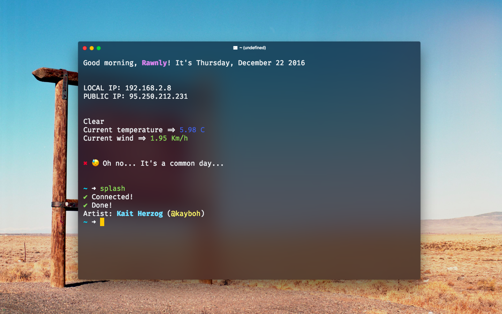
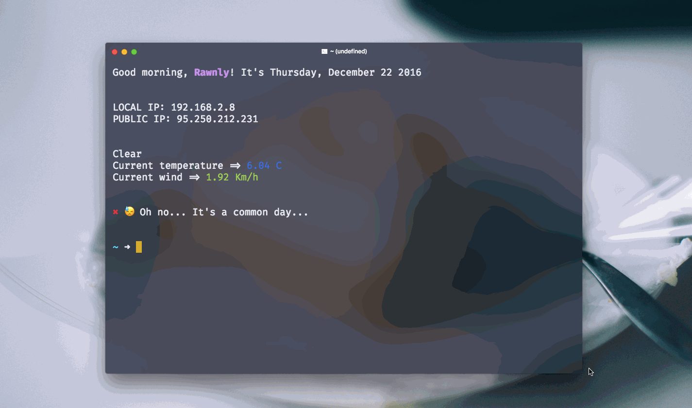

# Splash 
Set your wallpaper with beautiful photos token by [unsplash](http://unsplash.com)


> Got the same setup [here](http://github.com/Rawnly/dot-files)

## Installation
> Warning! Api rate limit is now 50 requests per hour, i'm waiting for unsplash approvation.


To install `splash-cli` you must use **npm** ( as always ) and do the following:

```bash
	$ npm i -g splash-cli
```

#### Dev Installation
If you want improve this module, you can do it!

1. Download the latest release
2. Open your shell and `cd` into project folder
3. Edit files and whatever you want
4. Link with `npm link` to test it out
5. And then `git pull` to improve

## Usage 

> All the photos are stored in the module directory

```bash 
	$ splash
    # Start download random photo 
    # and set it as wallpaper
```

## Options
### --clean
Clean all `splash-cli` photo caches.
```bash
	$ splash -c 		# or --clear
```

### --path
Get the `/photos` path.
```bash
	$ splash -p 		# or --path
```
<br>
<br>
<h5 align="center">
Made with a  ⌨️   in 🇮🇹
</h5>
